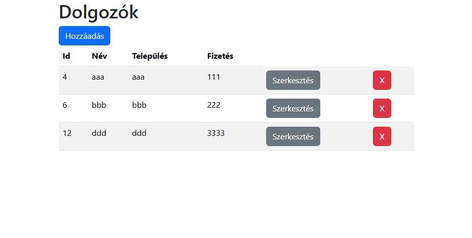
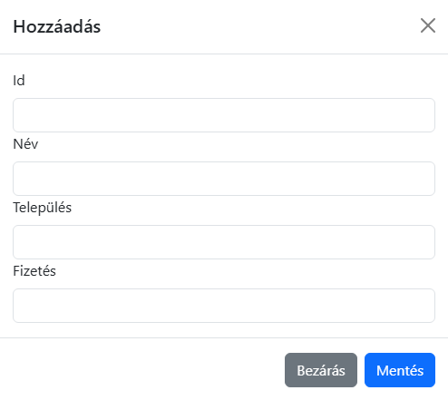
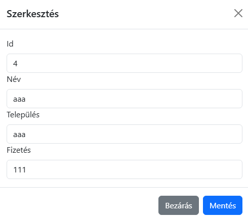

# Felhasználói dokumentáció

## Telepítés

Lépések:

* Letöltés
* Függőségek telepítése
* Backend indítása
* Frontend indítása

### Letöltés

Töltsük le a következő helyről:

- [https://github.com/Akreez/empke.git](útvonal)

Például:

```bash
git clone https://github.com/Akreez/empke.git
```

### Függőségek telepítése és Frontend Backend indítása

Backend:

```bash
cd api
npm install
npm start
```

Frontend:

```bash
cd web
npm install
npm start
```

## Dolgozók kezelése

A főoldalon a dolgozók listáját láthatjuk



Új dolgozó felvétele a táblázat felett a "Hozzáadás" gombra kattintva lehetséges.

Egy modális ablakon lehet megadni a dolgozó tulajdonságait.



A törlés a "Törlés" feliratú gombra kattintva kivitelezhető.

Egy dolgozó szerkesztése a "Szerkesztés" gombbal, egy adott sorban, egy újabb modális ablakkal lehetséges.

